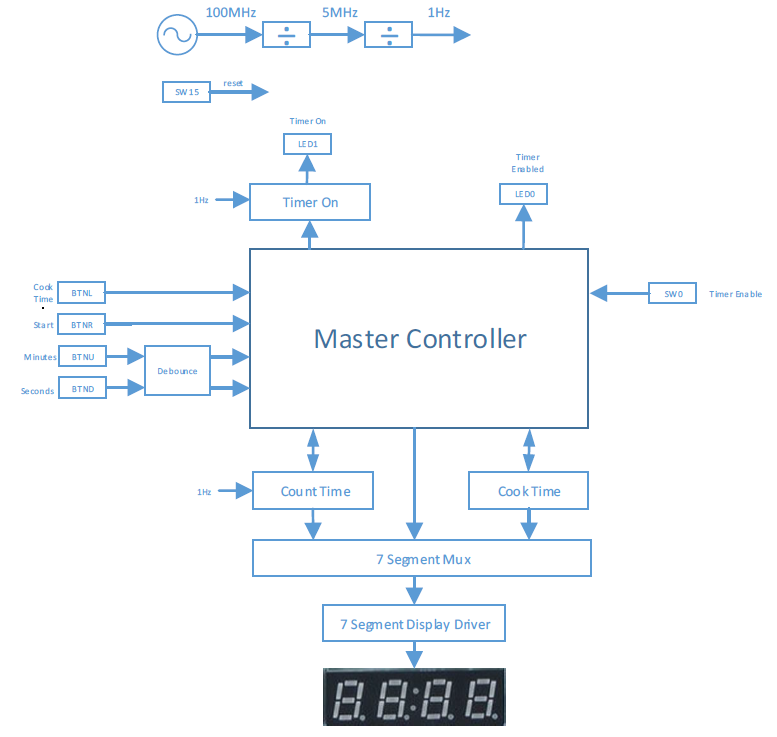
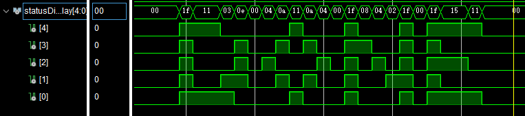
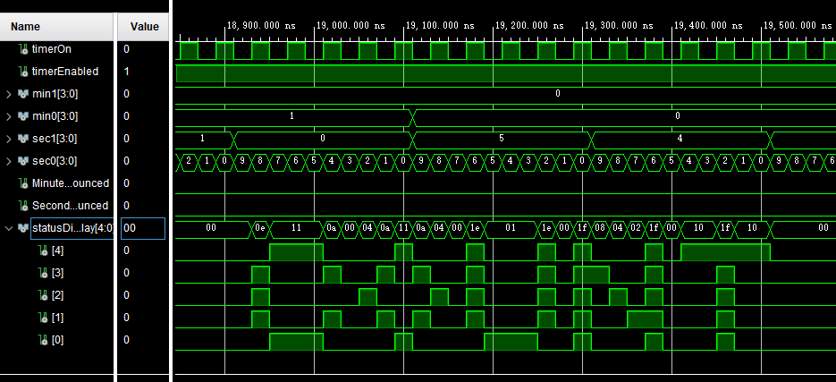
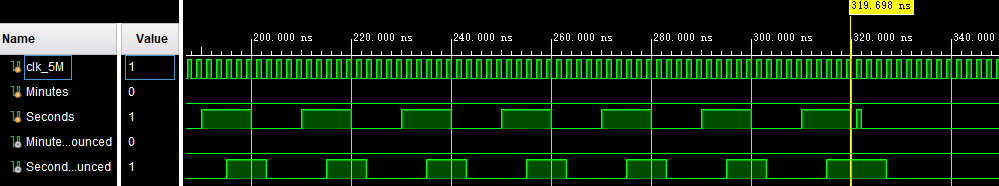
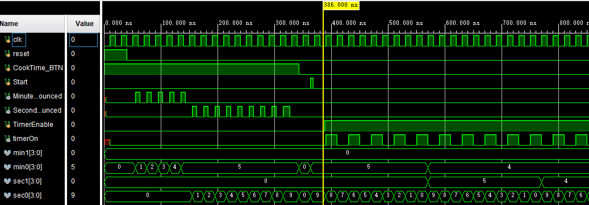
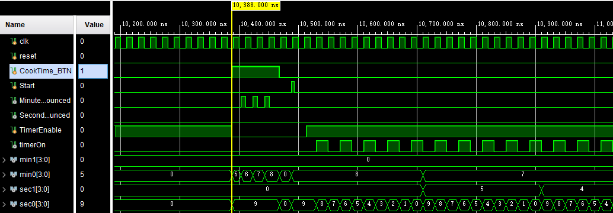

<pre>


                            ELEC 3500 - Lab 9

                              Egg Timer Lab


                             Ghassan Arnouk

                            Samuel (Wendi) Zhu


                          Instructor: Ralph Mason


                    Date Performed: March 25 & April 1, 2020


                        Date Submitted: April 7, 2020


</pre>

## **1 Introduction**

In this lab, an Egg Timer was theoretically built with Verilog using Vivado 2016.3 software.
The Egg Timer was simulated, and the simulation shows that the designed Egg Timer circuit is functionable. 
For the innovation aspect, a status display module was added to display the counter status in 
English words using the simulation waveforms.
The advantage of having this additional feature was to debug the counter status in simulation.

## **2 Design and Implementation**

The design of the Egg Timer was based on the schematic provided in the lab manual [1]. 
Figure 1 below shows the design block diagram taken from the lab manual [1].

The Egg Timer Design Block Diagram, taken from the lab manual [1], is shown below: 



Since the FPGA was not available at home, the clock divider and the 7 segment display blocks were not implemented, they were not essential to the design. Nevertheless, the clock divider circuit was programmed but didn’t use in the main Egg Timer module. The binary-coded-decimal (BCD) number display was used instead of the 7-segment display. This is because the BCD could be displayed in Roman Numeral in the simulation, and the 7-segment display signal was not readable in the simulation.

### **2.1 | Clocking**

The clock wizard with 5MHz output was generated, and a clock divider module was programmed to convert the 5MHz clock signal into 1Hz clock signal. These blocks were programmed and tested, but it was not used in the main module for simulation because the 1Hz and 5MHz clock signal could be generated directly in the simulation file.

The code for the **clock divider** module is shown below:

```verilog
// This module is to divide the 5M hz clock to generate a 1 Hz control signal
module Clocking(clk_1,clk_5M, reset, TimerEnable, locked);
    input clk_5M, reset, TimerEnable, locked;
    output reg clk_1;

    // register for counting purposes
    reg [25:0] count = 0;

    always @(posedge clk_5M or posedge reset) begin
        if (reset || !locked) begin
            count <= 0; // reset the count
            clk_1 <= 0; // reset the output
        end
        else if (TimerEnable) begin
            count <= count + 1;     // increment the counting
            if (count >= 2499999) begin     // count up to 5M/2 - 1 = 2499999
                clk_1 <= !clk_1;    // invert the output
            end
        end
    end
endmodule
```

### **2.2 | Debounce**

From the lab manual, the button inputs required debouncing. Although debouncing was not necessary in the simulation, the debounce circuit was implemented and tested in the Egg Timer module. The debounce circuit receives the button input, and it uses the 5MHz clock to generate the debounced version of the signal.

The code for the **debounce** module is shown below:

```verilog
// This module is use to debounce the input for the button using the 5M clock
module Debouncer(out, clk_5M, in);
    output reg out;
    input clk_5M, in;

    reg latch = 0;    // latch the data in for testing
    reg count = 0;    // count the clock edge

    always @(posedge clk_5M) begin
        count <= count + 1;     // increment the count
        if (count==0) begin  // first: latch the data
            latch <= in;
        end
        else begin  // then: check the input and the latch
            if (in == latch) begin
                out <= in;  // if same: output the input signal
            end
        end
    end
endmodule
```

### **2.3 | Master Controller**

In our design, the Master Controller was only responsible for the LEDs outputs, which indicated the Timer Enabled and
Timer On signals.

The code for the **Master Controller** module is shown below:

```verilog
// This master controller only deal with the LED outputs
module MasterController(timerOn, timerEnabled, countFinished, TimerEnable);
    input TimerEnable;
    input countFinished;    // from the count time module
    output reg timerOn, timerEnabled;

    //deal with the LEDs
    always @(TimerEnable or countFinished) begin
        if (TimerEnable) begin
            timerEnabled = 1;   // turn on the timer enabled LED
            if (countFinished) begin
                timerOn = 0;  // turn off the timer on LED
            end
            else begin
                timerOn = 1;    // turn on the timr on LED
            end
        end
        else begin
            timerEnabled = 0;   // turn off the timer enabled LED
        end
    end
endmodule


```

### **2.4 | Timer On**

The Timer On module receives the timer on signal from the Master Controller, and it uses the 1Hz clock signal to generate a toggling output to blink the timer on LED.

The code for **Timer On** module is shown below:

```verilog
// This module blink the led output to shown the user timer is on
module TimerOn(led1, clk_1, timerOn);
    input clk_1, timerOn;   // the timerOn come from MasterController to enable blinking
    output reg led1;

    always @(posedge clk_1) begin
        if (timerOn)    // act as an enble signal
            led1 <= !led1;  // toggle the led output
        else
            led1 <= 0;
    end
endmodule
```

### **2.5 | Count Time**

The Count Time module was **one of the most important** modules in our Egg Timer design. The Count Time module was responsible for the count down functionality. This module can reset the count time, load the start time, and enable to start counting down.

The code for the **Count Time** module is shown below:

```verilog
// This module module a count down timer that can load the cook time into the counter and start counting down
module CountTime(countFinished, min1, min0, sec1, sec0, clk_1, reset, enable, load, start_min1, start_min0, start_sec1, start_sec0);
    input clk_1, reset, enable, load;
    input [3:0] start_min1, start_min0, start_sec1, start_sec0;     // the start to load into the counter
    output reg [3:0] min1, min0, sec1, sec0;    // the bcd encoded output for minutes and seconds digits
    output reg countFinished;  // notify the Master Controller when counting is finished

    //deal with clock pulses with asynchronous reset and load
    always @(posedge clk_1 or posedge reset or posedge load) begin
        if (reset) begin    // reset counting to 0
            min1 = 0;
            min0 = 0;
            sec1 = 0;
            sec0 = 0;
            countFinished = 1;
        end
        else if (load) begin    // load the count to the starting time
            countFinished = 0;
            min1 = start_min1;
            min0 = start_min0;
            sec1 = start_sec1;
            sec0 = start_sec0;
        end
        else if (enable) begin  // starting counting down if enable
            if (min1==0 && min0==0 && sec1==0 && sec0==0) begin
                countFinished = 1;  // finished counting if count to 0
            end
            else begin  // start counting down
                sec0 <= sec0 - 1;   // decrease the second

                // deal with the min0 digit
                if (min0 == 0 && sec1 == 0 && sec0 == 0) begin
                    sec0 <= 9;
                    sec1 <= 5;
                    min0 <= 9;
                    min1 = min1 - 1;
                end
                else if (sec1 == 0 && sec0 == 0) begin  // deal with the sec1 digit
                    sec0 <= 9;
                    sec1 <= 5;
                    min0 <= min0 - 1;
                end
                else if (sec0 == 0) begin   // deal with the sec0 digit
                    sec0 <= 9;
                    sec1 <= sec1 - 1;
                end
            end
        end
    end
endmodule
```

### **2.6 | Cook Time**

The Cook Time module was designed to hold the start time for the Count Time module. The start time output for the Cook Time module could be set by receiving the second and minute button inputs.

The code for the **Cook Time** module is shown below:

```verilog
// This module hold the cook time
module CookTime(min1, min0, sec1, sec0, Minutes, Seconds, reset);
    input Minutes, Seconds, reset;  // the minute and second button inputs
    output reg [3:0] min1, min0, sec1, sec0;   // bcd encoded output for minute and second digits


    // deal with the seconds input
    always @(posedge Seconds or posedge reset) begin    // asynchrounous reset
        if (reset) begin    // set second digits to 0
            sec0 = 0;
            sec1 = 0;
        end
        else begin  // increment the second based on the second input
            sec0 = sec0 + 1;
            if (sec0 >= 10 && sec1<6) begin     // if count is 10: increment the sec1 digit and reset the sec0 digit
                sec0 = 0;
                sec1 = sec1 + 1;
            end

            if (sec1 >= 6) begin    // reset the second digit if counts to 59 seconds
                sec0 = 0;
                sec1 = 0;
            end
        end
    end

    // deal with minutes input
    always @(posedge Minutes or posedge reset) begin
        if (reset) begin    // reset minutes digits to 0
            min0 = 0;
            min1 = 0;
        end
        else begin  // increment the second based on the minute input
            min0 = min0 + 1;
            if (min0 >= 10 && min1 < 6) begin   // if count is 10: increment the min1 digit and reset the min0 digit
                min0 = 0;
                min1 = min1 + 1;    // increment the min1 digit
            end

            if (min1 >= 6) begin    // reset the minute digits if counts to 59 minutes
                min0 = 0;
                min1 = 0;
            end
        end
    end
endmodule
```

### **2.7 | Count Cook Mux**

The Count Cook Mux replaced the 7-segment mux in the design from the lab manual. The Count Cook Mux was designed to choose the signals from the Count Time or Cook Time modules based on the user inputs. The selected signal would be the final output to the Egg Timer BCD display.

The code for the **Count Cook Mux** module is shown below:

```verilog
// This module choose the output digits from the count time or cook time outputs
module CountCookMux(min1, min0, sec1, sec0, control, count_min1, count_min0, count_sec1, count_sec0, cook_min1, cook_min0, cook_sec1, cook_sec0);
    input [3:0] count_min1, count_min0, count_sec1, count_sec0;     // inputs from count time module
    input [3:0] cook_min1, cook_min0, cook_sec1, cook_sec0;     // inputs from cook time module
    input control;  // high to choose the cook time, low to choose the count time
    output reg [3:0] min1, min0, sec1, sec0;    // the output signal

    // deal with the control signal
    always @(control or cook_min1 or cook_min0 or cook_sec1 or cook_sec0
        or count_min1 or count_min0 or count_sec1 or count_sec0) begin  // high to choose the cook time, low to choose the count time
            if (control) begin  // select the data from cook time
                min1 = cook_min1;
                min0 = cook_min0;
                sec1 = cook_sec1;
                sec0 = cook_sec0;
            end
            else begin  // select the data from count time
                min1 = count_min1;
                min0 = count_min0;
                sec1 = count_sec1;
                sec0 = count_sec0;
            end
    end
endmodule


```

### **2.8 | Innovations**

For the innovation aspect, the Status Display module was implemented. The Status Display module receives the status input from the Count Time module, and it display the status (COUNT or DONE) using the waveform from the 5-bits outputs. The COUNT status indicated that the Egg Timer was counting, and the DONE status indicated that the Egg Timer was done counting. The waveform from the Status Display module looks like an English word in simulation, and it can be used in debugging the status of the Egg Timer. Figure 7.0 shown the output waveform for DONE status.



## **3 Simulation**

Since we didn’t have access to the FPGA, the Egg Timer circuit was **implemented** with simulation.

The simulation waveforms for the input/output signals form the Egg Timer is shown below. The waveforms show that the Egg Timer circuit was counting down, and they verified the count down function for the Egg Timer circuit.



### **3.1 | Simulation for Debouncer circuit**

The debounce functionality was tested by simulating a glitch in the button input and observing the debounced output.

The simulation output for the **debounce** circuit is shown below:



At around 320ns in the simulation, a glitch was introduced to the Egg Timer. The debounce circuit successfully debounced the button inputs, and the debounced version signal was received by the Egg Timer.

<pre>


</pre>

### **3.2 | Simulation for Setting the Start Time and Start Counting**

The simulation for **setting** the **start time** and **start counting** is shown below:



For the time before 386ns in the simulation, the Minute and Second signal were toggled to set the start time. The Minute signal toggled 5 times, and the Second signal toggled 9 times. The start time for the Egg Timer was successfully set to 5 minutes and 9 seconds as shown in Figure 10. For the time after 386ns in the simulation, the Timer Enable signal went high, and the Egg Timer started counting down. This simulation verified the setting and counting functions for the Egg Timer circuit.

### **3.3 | Stop, Set, and Restart Counting**

The simulation diagram to test the stop, set, and restart counting functions for the Egg Timer is shown below:



The simulation diagram above shows that the Egg Timer circuit can be disabled, set to a new time, and start counting down from the new time. This simulation verified the stop, set, and restart counting functions for the Egg Timer.

## **4 Conclusion**

In this lab, the Egg Timer was implemented **virtually** in simulation because we didn’t have access to the FPGA. The simulation shown that the Egg Timer met the design requirements, and the circuit was verified by the TA. For the innovation part, the Status Display module successfully displayed the status for the Egg Timer in English using the waveforms. The Status Display module allows an easier debugging process for the Egg Timer, and it also provide the status information in English for the user in simulation.

## **References**

[1] Egg Timer Lab. Ottawa: Carleton University.
