# Introduction to Verilog

:blue_book: My Verilog notes for my Digital Electronics course - written in markdown.

## Table of contents

Section 1: [Introduction](/Verilog%20Labs/Verilog_Tutorial.md#section-1-introduction)<br>
Section 2: [Lexical Tokens](/Verilog%20Labs/Verilog_Tutorial.md#section-2-lexical-tokens)<br>
Section 3: [Gate-Level Modelling](/Verilog%20Labs/Verilog_Tutorial.md#section-3-gate-level-modelling)<br>
Section 4: [Data Types](/Verilog%20Labs/Verilog_Tutorial.md#section-4-data-types)<br>
Section 5: [Operators](/Verilog%20Labs/Verilog_Tutorial.md#section-5-operators)<br>
Section 6: [Operands](/Verilog%20Labs/Verilog_Tutorial.md#section-6-operands)<br>
Section 7: [Modules](/Verilog%20Labs/Verilog_Tutorial.md#section-7-modules)<br>
Section 8: [Behavioral Modeling](/Verilog%20Labs/Verilog_Tutorial.md#section-8-behavioral-modeling)<br>
Section 9: [Timing Controls](/Verilog%20Labs/Verilog_Tutorial.md#section-9-timing-controls)<br>
Section 10: [Procedures: Always and Initial Blocks](/Verilog%20Labs/Verilog_Tutorial.md#section-10-procedures-always-and-initial-blocks)<br>
Section 11: [Functions](/Verilog%20Labs/Verilog_Tutorial.md#section-11-functions)<br>
Section 12: [Tasks](/Verilog%20Labs/Verilog_Tutorial.md#section-12-tasks-not-synthesizable)<br>
Section 13: [Component Inference](/Verilog%20Labs/Verilog_Tutorial.md#section-13-component-inference)<br>
Section 14: [Finite state Machines](/Verilog%20Labs/Verilog_Tutorial.md#section-14-finitie-state-machines-for-synthesis)<br>
Section 15: [Compiler Directives](/Verilog%20Labs/Verilog_Tutorial.md#section-15-compiler-directives)<br>
Section 16: [System Tasks and Functions](/Verilog%20Labs/Verilog_Tutorial.md#section-16-system-tasks-and-functions)<br>
Section 17: [Test Benches](/Verilog%20Labs/Verilog_Tutorial.md#section-17-test-benches)<br>

## Section 1: Introduction

**Verilog HDL** is one of the two most common Hardware Description Languages (HDL) used by integratred circuit (IC) designers. The other one is VHDL. 
**Verilog** is a language used for describing a digital system like a network switch or a microprocessor or a memory or a flip-flop.
It means, by using a HDL we can describe any digital hardware at any level.\
Designs described in HDL are technology-independent, easy to design and debug, and are usually more readable than schematics, particularly for large circuits.

Verilog can be used to describe designs at **four levels** of abstraction:

- **Algorithmic level:** much like C code with if, case, and loop statements.
- **Register transfer level:** RTL uses registers connected by Boolean equations.
- **Gate level:** interconnected AND, NOR, etc.
- **Switch level** the switches are MOS transistors inside gates.\
The language also defines **constructs** that can be used to control the input and output of simulation.

More recently, Verilog is used as an input for **synthesis programs** which will generate a gate-level description (a netlist) for the circuit.
Some Verilog constructs are **not** synthesizable.
Most readers will want to synthesize their circuits, so nonsynthesizable constrcuts should be used only for ***test benches***.

There are **two types** of code in most HDLs:

1. ***Structural:*** which is a verbal wiring diagram wihtout storage.

Example 1.1

```verilog
assign a = b & c | d;
assign d = e & (~c);
```

Here the *order* of the statements does **not** matter. Changing e will change a.

2. ***Procedual:*** which is used for circuits with storage, or as a convenient way to write conditional
logic.

Example 1.2

```verilog
always @(posedge clk)       // execute the next statement on every rising clock edge
    count <= count + 1;     // '<=' is called non-blocking assignment
```

Procedural code is written like C code and assumes every assignemnt is stored in memory until over written.
For synthesis, with flip-flop storage, this type of thinking generates too much storage.
Note that **if** and **case** statements are only allowed in procedural code.\
As a result, the synthesizers have been constructed which can recognize certain styles of precedural code as actually combinational.
They generate a **flip-flop** only for left-hand variables which truly need to be stored.
However, if you stray from this style, beware.
Your synthesis will start to fill with **superfluous latches**.

***Note:*** Verilog keyword are shown in **boldface**. Comments are shown in *italics*.

## Section 2: Lexical Tokens

Verilog source text files consists of the following lexical tokens:

### 2.1 White Space

White spaces separate words and can contain spaces, tabs, new-lines, and form feeds.
Thus a statement can extend over multiple lines wihtout special continuation characters.

### 2.2 Comments

Comments can be specified in two ways (exactly the same way as in C/C++):

- Begin the comment with double slashes `//`. All text betweent these characters and the end of the line
will be **ignored** by the **Verilog compiler**.
- Enclose comments between the characters `/*` and `*/`. Using this method allows you to continue comments
on more than one line. This is good for "commenting out" many lines of code, or for every brief in-line
comments.

Example 2.1

```verilog
a = c + d;      // this is a simple comment
            /* however, this comment continues on more
               than one line*/
assign y = temp_reg;
assign x = ABC /* plus its compliment*/ + ABC_;
```

### 2.3 Numbers

**Number storage** is defined as a number of **bits**, but values can be **specified** in binary, octal, decimal or hexadecimal.

Example 2.2

```verilog
3'b001, a 3-bit number.
5'd30, (= 5'b11110).
16'h5ED4, (= 16'd24276).
```

### 2.4 Identifiers

Identifiers are **user-defined words** for variables, function names, module names, block names and instance names.
Identifiers **begin** with a letter or underscore (not with a number or $) and can include any number of letters, digits and underscores.
Identifiers in Verilog are **case-sensitive**.

Example 2.3

```verilog
allowed symbols:
    ABCDE...abcdef...123456789_$
not allowed:
    anything else especially - & # @

adder           // use underscores to make your
by_8_shifter    // identifiers more meaningful
_ABC_       /* is not the same as */ _abc_
Read_       // is often used for NOT Read
```

### 2.5 Operators

Operators are one, two and sometimes three characters used to perform operations on vairbales.\
Examples include **>, +, ~, &, !=**.

### 2.6 Verilog Keywords

These are words that have special meaning in Verilog. Some examples are **assign, case, while, wire, reg and, or, nand,** and **module**. These should **not** be used as identifiers.

## Section 3: Gate-Level Modelling

Primitive logic gates are part of the Verilog language.
**Two** properties can be specified:

1. ***Drive_strength:*** specifies the strength at the gate outputs.\
The strongest output is a direct connection to a source, next comes a connection through a conducting transistor, then a resistive pull-up/down.\
The drive strength is usually not specified, in whcih case the strengths defaults to **strong1** and **strong0**.

2. ***Delays:*** if no delay is specified, the the gate has no propagation delay.\
If two delays are specified, the **first** represent the **rise delay**, the **second** the **fall delay**.\
If only one delay is specified, then rise and fall are equal.\
Delays are ***ignored in synthesis***. The parameters for the primitive gates have been predefined as delays.

### 3.1 Basic Gates

These implement the **basic logic gates**. The have **one output** and **one or more inputs**.
In the gate instantiation syntax shown below, GATE stands for one of the keywords **and, nand, or, nor, xor, xnor**.

***Syntax***

```verilog
GATE (drive_strength) #(delays) instance_name1 (output, input_1, input_2, ..., input_N),
                                instance_name2 (outpt, inpt_1, inpt_2, ..., inpt_N);
```

*Delay* is\
    #(rise, fall)   *or*\
    #rise_and_fall      *or*\
    #(rise_and_fall)

Example 3.1

```verilog
and c1(o, a, b, c, d),      // 4-input AND called c1 and
    c2(p, f, g);        // 2-input AND called c2

or #(4,3) ig(o, a, b);    /* or gate called ig (instance name);
                                rise time = 4, fall time = 3 */

xor #(5) xor1(a, b, c);    // a = b XOR c after 5 time units

xor (pull1, strong0) #5 (a, b, c);  /* Identical gate with pull-up strength pull1
                                        and pull-down strength strong0 */
```

### 3.2 buf, not Gates

These implement **buffers** and **inverters**, respectifely.
They have **one input** and **one or more outputs**.
In the gate instantiation syntax shown below, GATE stand for either the keyword **buf** or **not**.

***Syntax***

```verilog
GATE (drive_strength) #(delays) instance_name1 (output_1, output_2, ..., output_N, input),
                                instance_name2 (outpt1, outpt2, ..., outpt_N, inpt);
```

Example 3.2

```verilog
not #(5) not_1(a, c);    // a = NOT c after 5 time units

buf c1(o, p, q, r, in),   // 4-output and 2-output buffers
    c2(p, f, g);
```

### 3.3 Three-State Gates; bufif1, bufif0, notif1, notif0

These implement **3-state buffers** and **inverters**.
They propagate z (3-state or high-impedance) if their control signal is deasserted. These can have **three delay specifications**: a rise time, a fall time, and a time to go into 3-state.

Example 3.3

```verilog
bufif0 #(5) not_1(BUS, A, CTRL);    /* BUS = A
                                        5 time units after CTRL goes low */
notif1 #(3,4,6) c1(bus, a, b, cntr)     /* bus goes tri-state
                                            6 time units after ctrl goes low */
```

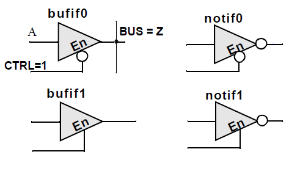

## Section 4: Data Types

### 4.1 Value Set

Verilog consists of only **four** basic values.
Almost all Verilog data types store all these values:

- **0** (logic zero, or false condition)
- **1** (logic one, or true condition)
- **x** (unknown logic value)
- **z** (high impedance state)
***Note:*** x and z have **limited use for synthesis**.

### 4.2 Wire

A **wire** represents a physical wire in a circuit and is used to connect gates or modules.
The value of a **wire** can be read, but **not assigned to**, in a function or block.
A **wire** does not store its value but must be driven by a continuous assignment statement or by connecting it to the output of a gate or module.

Other **specific types** of wires include:

- **wand** (wired-AND); the value of a wand depend on *logical AND* of all the drivers connected to it.
- **wor** (wired-OR); the value of a wor depend on *logical OR* of all the drivers connected to it.
- **tri** (three-state;) all drivers connected to a tri must be z, except one (which determines the value
of the tri).

***Syntax***

```verilog
wire [msb:lsb] wire_variable_list;      // msb: most significant bit
wand [msb:lsb] wand_variable_list;      // lsb: least significant bit
wor [msb:lsb] wor_variable_list;
tri [msb:lsb] tri_variable_list;
```

Example 4.1

```verilog
wire c;     // simple wire
wand d;

assign d = a;   /* value of d is the logical AND of */
assign d = b;     /*  a and b */

wire [9:0] A;   // a cable (vector) of 10 wires
```

### 4.3 Reg

A **reg** (register) is a data object that holds its value from one ***procedural*** assignment to the next.
They are **used only** in functions and procedural blocks.
A **reg** is a Verilog variable type and does **not** necessarily imply a physicacl register.
In multi-bit registers, data is stored as *unsigned* numbers and no sign extension is done for what the user might have thought were two's complement numbers.

***Syntax***

```verilog
reg [msb:lsb] reg_variable_list;
```

Example 4.2

```verilog
reg a;          // single 1-bit register variable
reg [7:0] tom;      // an 8-bit vector; a bank of 8 registers
reg [5:0] b, c;         //two 6-bit variables
```

### 4.4 Input, Output, Inout

These keywords declare input, output and bidirectional ports of a **module** or **task**.
Input and inout ports are of type **wire**.
An output port can be configured to be of type **wire, reg, wand, wor** or **tri**.
The default is **wire**.

***Syntax***

```verilog
input [msb:lsb] input_port_list;
output [msb:lsb] output_port_list;
inout [msb:lsb] inout_port_list;
```

Example 4.3

```verilog
module sample(b, e, c, a);
    input a;        // An input which defaults to wire
    output b, e;        // Two outputs which default to wire
    output [1:0] c;     /* A 2-bit output. One must declare its
                            type in a separate statement */
    reg [1:0] c;        // The above c port is declared as reg
endmodule
```

***Note:*** c port can also be declared as follows:

```verilog
output reg [1:0] c;
```

### 4.5 Integer

Integers are **general-purpose** variables.
For synthesois, they are used mainly as **loops-indicies, parameters, and constants**.
They are of implicitly of type **reg**.
However, they store data as signed numbers *whereas* explicitly declared **reg** types store them as unsigned.\
If they hold numbers which are not defined at compile time, their size will default to **32-bits**.\
If they hold constants, the synthesizer adjusts them to the minimum width needed at compilation.

***Syntax***

```verilog
integer integer_variable_list;
integer integer_constant;
```

Example 4.4

```verilog
integer a;      // single 32-bit integer
assign b = 63;      // 63 defaults to a 7-bit varibale. (2^6 = 64)
```

### 4.6 Supply0, Supply1

**Supply0** and **Supply1** define wires tied to logic 0 (ground) and logic 1 (power), respectively.

***Syntax***

```verilog
supply0 logic_0_wires;
supply1 logic_1_wires;
```

Example 4.5

```verilog
supply0 my_gnd;     // equivalent to a wire assigned to 0
supply1 a, b;       // often used for powering an output (Gate Level Modeling)
```

### 4.7 Time

Time is a 64-bit quantity that can be used in conjunction with the **$time** system task to hold simulation time.
Time is **not supported for synthesis** and hence is used only for simulation purposes.

***Syntax***

```verilog
time time_variable_list;
```

Example 4.6

```verilog
time c;
c = $time;       // c = current simulation time
```

### 4.8 Parameter

A **parameter** defines a constant that can be set when you instantiate a **module**.
This allows customization of a module during instantiation.

***Syntax***

```verilog
parameter par_1 = value,
          par_2 = value, ...;

parameter [range] par_3 = value;
```

Example 4.7

```verilog
parameter add = 2'b00, sub = 3'b111;
parameter n = 4;

parameter [3:0] param2 = 4'b1010;
...
reg [n-1:0] harry;  /* A 4-bit register whose length is set by parameter n above */

always @ (x)
    y = {{add-sub}{x}};     // The replication operator Section 5.8

    if (x) state = param2[1];
    else state = param2[2];
```

## Section 5: Operators

### 5.1 Arithmetic Operators

These perform arithmetic operations. The `+` and `-` can be used as either unary (-z) or binary (x-y) operators.

***Operators***

- `+` (addition)
- `-` (subtraction)
- `*` (multiplication)
- `/` (division)
- `%` (modulus)

Example 5.1

```verilog
parameter n = 4;
reg [3:0] a, c, f, g, count;

f = a + c;
g = c - n;
count + (count + 1) % 16;
```

### 5.2 Relational Operators

Relational operators compare two operands and return a single bit 1 or 0.
These operators synthesize into comparators.
Wire and reg variables are positive, thus (-3'b001) == 3'b111 and (-3d001) > 3d110.
However, for integers -1 < 6.

***Operators***

- `<` (less than)
- `<=` (less than or equal to)
- `>` (greater than)
- `>=` (greater than or equal to)
- `==` (equal to)
- `!=` (not equal to)

Example 5.2

```verilog
if (x == y) e = 1;
else e = 0;
                /* Equivalent Statement
                    e = (x == y);   */

// Compare in 2's compliment; a > b
reg [3:0] a, b;

if(a[3] == b[3]) a[2:0] > b[2:0];
else b[3];
```

### 5.3 Bit-wise Operators

Bit-wise operators do a bit-by-bit comparison between two operands.

***Operators***

- `~` (bitwise NOT)
- `&` (bitwise AND)
- `|` (bitwise OR)
- `^` (bitwise XOR)
- `~^` or `^~` (bitwise XNOR)

Example 5.3

```verilog
module and2 (a, b, c);
    input [1:0] a, b;
    output [1:0] c;

    assign c = a & b;
endmodule
```

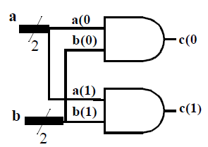

### 5.4 Logical Operators

Logical operators return a single bit 1 or 0.
They are the same as bit-wise operators **only** for single bit operands.
They can work on expressions, integers or groups of bits, and treat all values that are non-zero as **"1"**.
Logical operators are typically used in conditional (**if** .. **else**) statements since they work with expressions.

***Operators***

- `!` (logical NOT)
- `&&` (logical AND)
- `||` (logical OR)

Example 5.4

```verilog
wire [7:0] x, y, z;     // x, y and z are multibit variables
reg a;
...
if ((x == y) && z) a = 1;   // a = 1 if x equals y, and z is non-zero
else a = !x;    // a = 0 if x is anything but zero
```

### 5.5 Reduction Operators

Reduction operators operate on all the bits of an operand vector and reutrn a single-bit value.
These are the unary (one argument) form of the bit-wise operators above.

***Operators***

- `&` (reduction AND)
- `|` (reduction OR)
- `~&` (reduction NAND)
- `~|` (reduction NOR)
- `^` (reduction XOR)
- `~^` or `^~` (reduction XNOR)

Example 5.5

```verilog
module chk_zero (a, z);
    input [2:0] a;
    output z;

    assign z = ~| a;    // Reduction NOR
endmodule
```

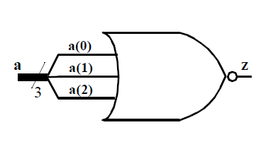

### 5.6 Shift Operators

Shift operators shift the first operand by the number of bits specified by the second operand.
Vacated positions are filled with zeros for both left and right shifts (there is no sign extension).

***Operators***

- `<<` (shift left)
- `>>` (shift right)

Example 5.6

```verilog
assign c = a << 2;      /* c = a shifted left 2 bits (a is multiplied by 4).
                            vacant positions are filled with 0's */
```

### 5.7 Concatenation Operator

The concatenation operator combines two or more operands to form a larger vector.

***Operators***

- `{}` (concatenation)

Example 5.7

```verilog
wire [1:0] a, b;
wire [2:0] x;
wire [3:0] y, Z;

assign x = {1'b0, a};   // x[2]=0, x[1]=a[1], x[0]=a[0]
assign y = {a, b};      // y[3]=a[1], y[2]=a[0], y[1]=b[1], y[0]=b[0]

assign {cout, y} = x + Z;   // concatenation of a result
```

### 5.8 Replication Operator

The replication operator makes multiple copies of an item.

***Operators***

- `{n{item}}` (n fold replication of an item)

Example 5.8

```verilog
wire [1:0] a, b;
wire [4:0] x;

assign x = {2{1'b0}, a};    // Equivalent to x = {0,0,a}
assign y = {2{a}, 3{b}};    // Equivalent to y = {a,a,b,b}
```

***Note:*** for synthesis, it does not like a zero replication.

```verilog
parameter n = 5, m = 5;
assign x = {(n-m){a}};
```

### 5.9 Conditional Operator: "?"

Conditional operator is like those in C/C++.
They evaluate one of the two expressions based on a condition.
It will synthesize to a multiplexer (MUX).

***Operators***

(cond) ? (result if cond true) : (result if cond false);

Example 5.9

```verilog
assign a = (g) ? x : y;

assign a = (inc == 2) ? a+1 : a-1;
    /* if (inc == 2) a=a+1, else a=a-1 */
```

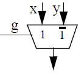

### 5.10 Operator Precedence

The table below shows the **precedence of operators** from highest to lowest.
Operators on the **same level** evaluate from left to right.
It is strongly recommended to use parentheses to define order of precedence and improve the readability of your code.

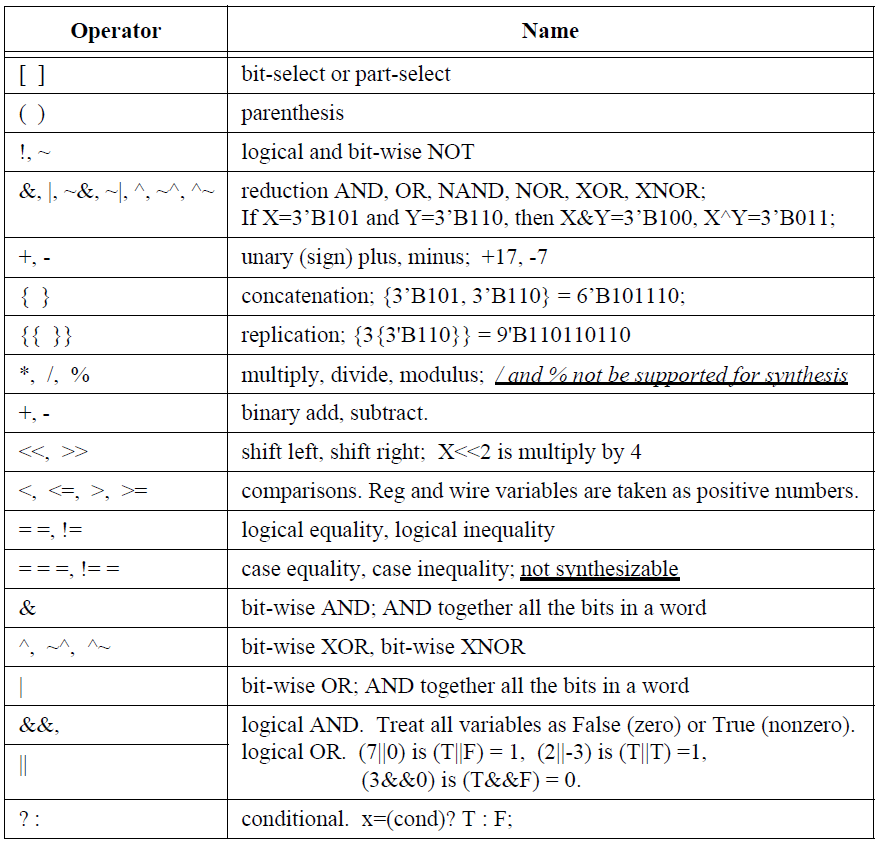

## Section 6: Operands

### 6.1 Literals

Literals are constant-valued operands that can be used in Verilog expressions. The two common Verilog literals are:

1. String: A string literal is a one-dimensional array of characters enclosed in double quotes (" ").
2. Numeric: constant numbers specified in binary, octal, decimal or hexadecimal.

***Number Syntax***

- `n'Fddd...` where

`n` integer representing number of bits\
`F` one of four possible base formats:

- `b` (binary)
- `o` (octal)
- `d` (decimal)
- `h` (hexadecimal)

***Note:*** Default is `d`. dddd - legal digits for the base format.

Example 6.1

```verilog
"time is"   // string literal
267     // 32-bit decimal number. Defaults to 32-bits if not specified
2'b01   // 2-bit binary
20'hB36F    // 20-bit hexadecimal number
'o62    // 32-bit octal number
```

### 6.2 Wires, Regs, and Parameters

Wires, regs and parameters can also be used as operands in Verilog expressions.

### 6.3 Bit-Selects "x[3]" and Part-Selects "x[5:3]"

Bit-selects and part-selects are a selection of a single bit and a group of bits, respectively, from a wire, reg or parameter vector using square brackets `[]`.
Bit-selects and part-selects can be used as operands in expressions in much the same way that their parent data objects are used.

***Syntax***

```verilog
variable_name[index]
variable_name[msb:lsb]
```

Example 6.2

```verilog
reg [7:0] a, b;
reg [3:0] ls;
reg c;

c = a[7] & b[7];    // bit-selects
ls = a[7:4] + b[3:0];   // part-selects
```

### 6.4 Function Calls

The return value of a function can be used directly in an expression without first assigning it to a register or wire variable.
Simply place the function call as one of the operands.
Make sure you know the bit width of the return value of the function call.

***Syntax***

```verilog
function_name (argument_list)
```

Example 6.3

```verilog
assign a = b & c & chk_bc(c,b);     // chk_bc is a function

/* Definition of the function */
function chk_bc;    // function definition
    input c, b;

    chk_bc = b ^ c;
endfunction
```

## Section: 7 Modules

### 7.1 Module Declaration

A module is the principle design entity in Verilog.
The *first line* of a module declaration specifies the name and port list (arguments).
The *next few lines* specifies the i/o type (**input, output,** or **inout**) and width of each port.
The default port width is 1 bit.

Then the port variables must be declared **wire, wand, ..., reg**. The default is **wire**.
Typically, inputs are **wire** since their data is latched outside the module.
Outputs are type **reg** if their signals were stored inside an **always** or **intital** block.

***Syntax***

```verilog
module module_name (port_list);
    input [msb:lsb] input_port_list;
    output [msb:lsb] output_port_list;
    inout [msb:lsb] inout_port_list;
            ...statements...
endmodule
```

Example 7.1

```verilog
module add_sub(add, in1, in2, oot);
    input add;
    input [7:0] in1, in2;   wire in1, in2;
    output [7:0] oot;       reg oot;
            ...statements...
endmodule
```

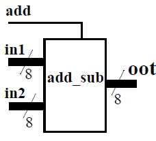

### 7.2 Continuous Assignment

The continuous assignment is used to assign a value onto a wire in a module. It is the normal assignment outside of **always** or **initial** blocks.
Continuous assignment is done with an explicit **assign** statement or by assigning a value to a wire during its declaration.
The order of assign statements **does not** matter.
Any change in any of the right-hand-side inputs will immediately change a left-hand-side output.

***Syntax***

```verilog
wire wire_variable = value;
assign wire_variable = expression;
```

Example 7.2

```verilog
wire [1:0] a = 2'b01;   // assigned on declaration

assign b = c & d;       // using assign statement
assign d = x | y;
/* The order of the assign statements
        does not matter */
```

### 7.3 Module Instantiations

Module declarations are template from which one creates actual objects (instantiations).
Modules are instantiated inside other modules, and each instantiation creates a unique object from the template.
The exception is the top-level module which is its own instantiation.

The instantiated module's ports must be matched to those defined in the template.
This is specified:

1. by name, using a dot (.) **".template_port_name (name_of_wire_connected_to_port)"**. (inside in, outisde out)
2. by position, placing the ports in **exactly the same positions** in the port lists of both the template and the in instance.

***Syntax***

```verilog
module_name instance_name_1 (port_connection_list),
            instance_name_2 (port_connection_list),
            ...
            instance_name_n (port_connection_list);
```

Example 7.3

```verilog
// MODULE DEFINITION
module and4(a, b, c);
    input [3:0] a, b;
    output [3:0] c;

    assign c = a & b;
endmodule

// MODULE INSTANTIATIONS
wire [3:0] in1, in2;
wire [3:0] o1, o2;

/* C1 is an instance of module and4. C1 ports referenced by position */
and4 C1(in1, in2, o1);

/* C2 is another instance of module and4. C2 ports are referenced to the declaration by name */
and4 C2(.c(o2), .a(in1), .b(in2));
```

***Note:*** modules may **not** be instantiated inside procedural blocks.

### 7.4 Parameterized Modules

You can build modules that are parameterized and specify the value of the parameter at each instantiation of the module.
Primitive gates have parameters which have been predefined as delays.

***Syntax***

```verilog
module_name #(parameter_vales) instance_name(port_connection_list);
```

Example 7.4

```verilog
// MODULE DEFINITION
module shift_n(it, ot);     // used in module test_shift
    input [7:0] it;
    output [7:0] oot;

    parameter n = 2;        // default value of n is 2

    assign ot = (it << n);      // it shifted left n times
endmodule

// PARAMETERIZED INSTANTIATIONS
wire [7:0] in1, ot1, ot2, ot3;

shift_n      shft2(in1, ot1);    // shift by 2; default
shift_n #(3) shft3(in1, ot2);   // shift by 3; override parameter 2
shift_n #(5) shft3(in1, ot3);   // shift by 5; override parameter 2
```

***Note:*** synthesis does not support the **defparam** keyword which is an alternative way of changing parameters.

## Section 8: Behavioral Modeling

Verilog can be used to describe designs at **four levels** of abstraction:

- **Switch level:** the switches are MOS transistors inside gates.
- **Gate level:** interconnected AND, NOR, etc.
- **Data-Flow level:** much like C code with if, case, and loop statements.
- **Behavioral or Preocedural level:** described blow.\
Verilog procedural statements are used to model a design at a higher level of abstraction than the other levels.
They provide powerful ways of doing complex designs.
However, small changes in coding methods can cause large changes in the hardware generated.
Procedural statements can only be used in procedures.

### 8.1 Procedural Assignments

Procedural assignments are assignment statements used within Verilog procedures (**always** and **initial** blocks).
Only **reg** variables and **integers** (and their bit/part-selects and concatenations) can be placed left of the `=` in procedures.
The right hand side of the assignment is an expression which may use any of the operator types described in Section 5.

### 8.2 Delay in Assignment (Not for Synthesis)

In a *delay assignment* delta-t time units pass before the statement is executed and the left-hand assignment is made.
With *inta-assignment delay*, the right side is evaluated immediately but there is a delay of delta-t before the result is place in the left hand assignment.
If another procedure changes a right-hand side signal during delta-t, it does not effect the output.
Delays are not supported by synthesis tools.

***Syntax for Procedural Assignment***

```verilog
variable = expression;
```

***Delayed assignment***

```verilog
#delta-t variable = expression;
```

***Intra-assignment delay***

```verilog
variable = #delta-t expression;
```

Example 8.1

```verilog
reg [6:0] sum;
reg hat, ziltch;

sum[7] = b[7] ^ c[7];   // execute now
zlitch = #15 ckz & a;   /* ckz&a evaluated now; ziltch changed
                                after 15 time units */
#10 hat = b & c;        /* 10 units after ziltch changes, b&c is
                                evaluated and hat changes */
```

### 8.3 Blocking Assignments

Procedural (blocking) assignments (=) are done sequentially **in the order** the statements are written.
A second assignment is not started until the preceding one is complete.

***Syntax***

```verilog
Blocking
    variable = expression;
    variable = #delta-t expression;         /* grab inputs now, deliver answer later */

    #delta-t variable = expression;         /* grab inputs later, deliver answer later */
```

Example 8.2.1 (for simulation)

```verilog
initial
    begin
        a = 1;
        b = 2;
        c = 3;

        #5          // wait for 5 units,
        a = b + cl  // and execute a = b+c = 5
        d = a;  // time continuous from last line, d=5 at t=5
```

Example 8.2.2 (for synthesis)

```verilog
always @(posedge clk)
    begin
        Z=Y; Y=X;   // shift register

        y=x; z=y;   // parallel flip-flops
```

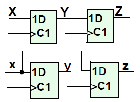

### 8.4 Non-blocking (RTL) Assignments (see below for synthessis)

RTL (non-blocking) assignments (<=), which follow each other in the code, are done in **parallel**.
The right hand side of non-blocking assignments is evaluated **starting from the completion of the last blocking assignment** or if none, **the start of the procedure**.
The transfer to the left hand side is made according to the delays.
A delay in a non-blocking statement will not delay the start of any subsequent statement blocking or non-blocking.

***Note:*** a good habit is to use `<=` if the same variable appears on both sides of the equal sign (see example 8.3.1 below).

***For Synthesis***

- One must not mix `<=` or `=` in the same procedure.
- `<=` best mimics what physical flip-flops do; use it for `always @(posedge clk ..)` type procedures.
- `=` best corresponds to what C/C++ code would do; use it for **combinational** procedures.

***Syntax***

```verilog
Non-Blocking
    variable <= expression;
    variable <= #delta-t expression;
    #delta-t variable <= expression;
```

Example 8.3.1 (for simulation)

```verilog
initial
    begin
        #3
        b <= a;     /* grab a at t=0. Deliver b at t=3 */

        #6
        x <= b + c;     /* grab b+c at t=0, wait and assign x at t=6
                            x is unaffected by b's changes */
```

Example 8.3.2 (for synthesis)

```verilog
always @(posedge clk)
    begin
        Z<=Y; Y<=X;   // shift register

        y<=x; z<=y;   // parallel flip-flops
```


Example 8.3.3 (use `<=` to transform a variable into itself)

```verilog
reg [7:0] G;

always @(posedge clk)
    G <= {G[6:0], G[7]};    // End around rotate 8-bit register
```

The following example shows interactions between blocking and non-blocking for simulation.
Do **not** mix the two types in one procedure **for synthesis**.

***Syntax***

```verilog
Non-Blocking
    variable <= expression;
    variable <= #delta-t expression;
    #delta-t variable <= expression;

Blocking
    variable = expression;
    variable = #delta-t expression;
    #delta-t variable = expression;
```

Example 8.4 (for simulation only)

```verilog
initial begin
    a = 1;
    b = 2;
    c = 3;
    x = 4;

    #5
    a = b + c;  // wait for 5 units, then grab b,c and execute a = 2+3
    d = a;      // time continuous from last line, d=5 at t=5

    x <= #6 b + c;  // grab b+c now at t=5, don't stop, make x=5 at t=11
    b <= #2 a;  // grab a at t=5 (end of last blocking statement). Deliver b=5 at t=7. Previous x is unaffected by b's change
    y <= #1 b + c;  // grab b+c at t=5, don't stop, make x=5 at t=6

    #3
    z = b + c;  // grab b+c at t=8, make z=5 at t=8
    w <= x;     // make w=4 at t=8. Starting at last block assignment
end
```

### 8.5 begin ... end

begin ... end block statements are used to group several statements for use where one statement is syntactically allowed.
Such places include functions, **always** and **initial** blocks, **if**, **case** and **for** statemnet.
Blocks can optionally be name

***Syntax***

```verilog
begin : block_name
    reg [msb:lsb] reg_variable_list;
    integer [msb:lsb] integer_list;
    parameter [msb:lsb] parameter_list;
            ...statements...
end
```

Example 8.5

```verilog
function trivial_one;   // the block name is "trivial_one"
    input a;

    begin: adder_blk;   // block named adder, with local integer i
    integer i;
        ...statements...
    end
```

### 8.6 for Loops

Similar to for loops in C/C++, they are used to repeatedly execute a statement or block of statements.
If the loop contains only one statement, the **begin** ... **end** statements may be omitted.

***Syntax***

```verilog
for (count = value1; count </<=/>/>= value2; count = count +/- step)
    begin
        ...statements...
    end
```

Example 8.6

```verilog
for (j = 0; j <= 7; j = j+1) begin
    c[j] = a[j] & b[j];
    d[j] = a[j] | b[j];
end
```

8.7 while Loops

The **while** loop repeatedly executes a statement or block of statements until the exxpression in the while statement evaluates to false.
To avoid combinational feedback during ***synthesis***, a while loop must be broken with an `@(posedge/negedge clock)` statement (Section 9.2). For simulation, a delay inside the loop will suffice.
If the loop contains only one statement, the begin ... end statements may be omitted.

***Syntax***

```verilog
while (expression)
    begin
        ...statements...
    end
```

Example 8.7

```verilog
while (!overflow) begin
    @(posedge clk);
    a = a + 1;
end
```

### 8.8 forever Loops

The **forever** statements executes an infinite loop of a statement or block of statements.
To avoid combinational feedback during **synthesis**, a forever loop must be broken with an @(posedge/negedge clock) statement (Section 9.2).
For simulation, a delay inside the loop will suffice.
If the loop contains only one statement, the begin ... end statements may be omitted.

***Syntax***

```verilog
forever
    begin
        ...statements...
    end
```

Example 8.8

```verilog
while (!overflow) begin
    @(posedge clk);     // or use a = #9 a+1
    a = a + 1;
end
```

### 8.9 repeat (Not Synthesizeable)

The repeat statement executes a statement or block of statements a fixed number of times.

***Syntax***

```verilog
repeat (number_of_times)
    begin
        ...statements...
    end
```

Example 8.9

```verilog
repeat (2) begin    // after 50, a = 00
    #50
    a = 2'b00;      // after 100, a = 01

    #50             // after 150, a = 00
    a = 2'b01;
end                 // after 200, a = 01
```

### 8.10 disable

Execution of a disable statemnet terminates a block and passes control to the nexxt statement after the block.
It is like the C *break* statement except it can terminate any loop, not just the one in which it appears.
Disable statements can only be used with named blocks

***Syntax***

```verilog
disable block_name;
```

Example 8.10

```verilog
begin: accumulate
    forever begin
        @(posedge clk);
        a = a + 1;

        if (a == 2'b0111) disable accumulate;
    end
end
```

### 8.11 if ... else if ... else

The **if** ... **else if** ... **else** statements execute a statement or block of statements depending on the result of the expression following the if.
If the conditional expressions in all the if's evaluate to false, then the statements in the else block, if present, are executed.\
There can be as many **else if** statements as required, but only one **if** block and one **else** block.
If there is one statement in a block, then the **begin** .. **end** statements may be omitted.
Both the **else if** and **else** statements are optional. However, if all possibilities are not specifically covered, **synthesis will generate extra latches**.

***Syntax***

```verilog
if (expression)
    begin
        ...statements...
    end
else if (expression)
    begin
        ...statements...
    end
...more else if blocks...
else
    begin
        ...statements...
    end
```

Example 8.11

```verilog
if (alu_func == 2'b00)
    aluout = a + b;
else if (alu_func == 2'b01)
    aluout = a - b;
else if (alu_func == 2'b10)
    aluout = a & b;
else    // alu_func == 2'b11
    aluout = a | b;

if (a == b) begin       // this if with no else will generate
    x = 1;              // a latch for x and ot. This is so they
    ot = 4'b1111;       // will hold there old value if (a != b)
end
```

### 8.12 case

The **case** statement allows a multipath branch based on comparing the *expression* with a list of *case choices*.
Statements in the **default** block executes when none of the *case choice* comparisons are true (similar to the else block in the if .. else if .. else).
If no comparisons, including default, are true, synthesizers will generate **unwanted latches**.\
Good practice says to **make a habit of puting in a default** whether you need it or not.\
If the defaults are **don't cares**, define them as **'x'** and the logic minimizer will treat them as don't cares.\
Case choices may be a simple constant or expression, or a comma-separated list of same.\
If there is one statement in a block, then the **begin** .. **end** statements may be omitted.

***Syntax***

```verilog
case (expression)
    case_choice1: begin
        ...statements...
    end

    case_choice2: begin
        ...statements...
    end

    ...more case choices blocks...

    default: begin
        ...statements...
    end
endcase
```

Example 8.12.1

```verilog
case (alu_ctr)
    2'b00: aluout = a+b;
    2'b01: aluout = a-b;
    2'b10: aluout = a&b;
    default: aluout = 1'bx;     // treated as don't cares for minimum logic generation
endcase
```

Example 8.12.2

```verilog
case (x, y, z)
    2'b00: aluout = a+b;    // case if x OR y OR z is 2'b00
    2'b01: aluout = a-b;
    2'b10: aluout = a&b;

    default: aluout = a|b;
endcase
```

### 8.13 casex

In **casex**(a) the case choices constant "a" may contain z, x or ? which are used as don't cares for comparison.
With **case** the corresponding simulation variable would have to match a tri-state, unknown, or either signal.
In short, **case** uses x to compare with an unknown signal. **casex** uses x as a don't care which can be used to minimize logic.

***Syntax***

```verilog
Same as for case statement:

case (expression)
    case_choice1: begin
        ...statements...
    end

    case_choice2: begin
        ...statements...
    end

    ...more case choices blocks...

    default: begin
        ...statements...
    end
endcase
```

Example 8.13

```verilog
casex (a)
    2'b1x: msb = 1;         /* msb=1 if a=10 or a=11
    if this were case(a), then only a=1x would match */

    default: msb = 0;
endcase
```

### 8.14 casez

**casez** is the same as casex except only ? and z (not x) are used in the case choice constants as don't cares.
**casez** is favored over **casex** since in simulation, an inadvertent x signal, will not be matched by a 0 or 1 in the case choice.

***Syntax***

```verilog
Same as for case statement:

case (expression)
    case_choice1: begin
        ...statements...
    end

    case_choice2: begin
        ...statements...
    end

    ...more case choices blocks...

    default: begin
        ...statements...
    end
endcase
```

Example 8.14

```verilog
casez (d)
    3'b1??: b = 2'b11;  // b=11 if d=100 or greater
    3'b01?: b = 2'b10;  // b=10 if d=010 or d=011

    default: b = 2'b00;
endcase
```

## Section 9: Timing Controls

### 9.1 Delay Control (Not Synthesizable)

This specifies the delay time units before a statement is executed during simulation.
A delay time of zero can also be specified to force the statement to the end of the list of statements to be evaluated at the current simulation time.

***Syntax***

```verilog
#delay statement;
```

Example 9.1

```verilog
#5 a = b + c;   // evaluated and assigned after 5 time units
#0 a = b + c;   // very last statement to be evaluated
```

### 9.2 Event Control, @

This causes a statement or **begin-end** block to be executed only after specified events occur.
An event is a change in a variable, and the change may be: a positive edge, a negative edge, or either (a level change), and is specified by the keyword **posedge**, **negedge**, or no keyword respectively.
Several events can be combined with the **or** keyword. Event specification begins with the character **@** and are usually used in **always** statements.\
For synthesis, one cannot combine level and edge changes in the same list.
For flip-flop and register synthesis, the standard list contains only a clock and an optional reset. For synthesis to give combinational logic, the list must specify only level changes and must contain all the variables appearing in the right-hand-side of statements in the block.

***Syntax***

```verilog
@(posedge variable or negedge variable) statement;

@(variable or variable ...) statement;
```

Example 9.2

```verilog
always
@(posedge clk or negedge rst)
    if (rst) Q = 0;     // Definition for a D flip-flop
    else Q = D;

@(a or b or e)      // re-evaluate if a or b or e changes
sum = a + b + e;    // will synthesize to a combinational adder
```

### 9.3 Wait Statement (Not Synthesizable)

The **wait** statement makes the simulator wait to execute the statement(s) following the wait until the specified condition evalutes to true.
Not supported for synthesis.

***Syntax***

```verilog
wait (condition_expression) statement;
```

Example 9.3

```verilog
wait (!c) a = b;    // wait until c=0, then assign b to a
```

### 9.4 Intra-Assignment Delay (Not Synthesizable)

This delay #delt is placed after the equal sign.
The left-hand assignment is delayed by the specified time units, but the right-hand side of the assignment is evaluated before the delay instead of after the delay.
This is important when a variable may be changed in a concurrent procedure.

***Syntax***

```verilog
variable = #delta-t expression;
```

Example 9.4

```verilog
always
assign a = 1;
assign b = 0;

alwasy @(posedge clk)
    b = #5 a;       // b=a after 5 time units

always @(posedge clk)
    c = #5 b;      /* b was grabbed in this parallel procedure before
                        the first procedure changed it */
```

## Section 10: Procedures: Always and Initial Blocks

### 10.1 Always Block

The always block is the primary construct in RTL modeling.
Like the continuous assignment, it is a concurrent statement that is continuously executed during simulation.
This also means that **all always blocks** in a module execute **simulatneously**.

This is very unlikke conventional programming languages, in whcih all statements execute sequentially.
The always block can be used to imply latches, flip-flops or combinational logic.
If the statements in the **always block** are enclosed within **begin ... end**, the statements are executed **sequentially**.
If enclosed within the **fork ... join**, they are executed **concurrently** (simulation only).

The always block is triggered to execute by the level, positive edge, or negative edge of one or more signal (separate signal by the keyword **or**).
A double-edge trigger is implied if you include a signal in the event list of the always statement.
The single edge-triggers are specified by **posedge** and **negedge** keywords.

Procedures can be named.
In simulation, one can **disable** named blocks.
For synthesis, it is mainly used as a comment.

***Synatx 1***

```verilog
always @(event_1 or event_2 or ...)
    begin
        ...statements...
    end
```

***Synatx 2***

```verilog
always @(event_1 or event_2 or ...)
    begin: name_for_block
        ...statements...
    end
```

Example 10.1

```verilog
always @(a or b);       // level-triggered if a or b changes levels
always @(posedge clk);  // edge-triggered:on +ve edge of clk
```

### 10.2 Initial Block

The initial block is like the always block except that is is executed **only once** at the beginning of the simulation.
It is typically used to initialize variables and specify signal waveforms during simulation.
Initial blocks are **not** supported for synthesis.

***Syntax***

```verilog
initial
    begin
        ...statements...
    end
```

Example 10.2

```verilog
initial begin
    clr = 0;    // variables initialized at
    clk = 1;    // the beginning of the simulation
end

initial begin
    a = 2'b00;      // at t=0, a=00
    #50 a = 2'b01;  // at t=50, a=01
    #50 a = 2'b10;  // at t=100, a=10
end
```

## Section 11: Functions

Functions are declared within a module, and can be called from continuous assignments, always blocks or other functions.
In a continuous assignment, they are evaluated when any of its declared inputs change.
In a procedure, they are evaluated when invoked.\
Functions describe combinational logic, and by do not generate latches.
Thus an if without an else will simulate as though it had a latch but synthesize without one.
This is a particularly bad case of synthesis not following the simulation. It is a good idea to code functions so they would not generate latches if the code was used in a procedure.\
Functions are a good way to reuse procedural code, since modules cannot be invoked from a procedure.

### 11.1 Function Declaration

A function declaration specifies the name of the function, the width of the function return value, the function input arguments, the variables (reg) used within the function, and the function local parameters and integers.

***Syntax, Function Declaration***

```verilog
function [msb:lsb] function_name;
    input [msb:lsb] input_arguments;
    reg [msb:lsb] reg_variable_list;
    parameter [msb:lsb] parameter_list;
    integer [msb:lsb] integer_list;
        ...statements...
endfunction
```

Example 11.1

```verilog
function [7:0] my_func;     // function return 8-bit value
    input [7:0] i;
    reg [4:0] temp;
    integer n;

    temp = i[7:4] | (i[3:0]);
    my_func = {temp, i[1:0]};
endfunction
```

### 11.2 Function Return Value

When you declare a function, a **variable** is also implicitly declared with the same name as the function name, and with the width specified for the function name (the default width is **1-bit**).
This variable is *my_func* in example 11.1.
At least one statement in the function must assign the function return value to this variable.

### 11.3 Function Call

As mentioned in Section 6.4, a function call is an operand in an expression.
A function call must specify in its terminal list all the input parameters.

### 11.4 Function Rules

The following are some of the general rules for functions:

- Must contain at least one input argument.
- Cannot contain an inout or output declaration.
- Cannot time controlled statements (#, @, wait).
- Cannot enable tasks.
- Must contain a statement that assigns the return value to the implicit function name register.

### 11.5 Function Example

A function has **only one** output.
If more than one return value is required, the outputs should be concatenated into one vector before assigning it to the function name.
The calling module program can then extract (unbundle) the individual outputs from the concatenated form. Example 11.2 shows how this is done, and also illustrates the general use and syntax of functions in Verilog moduling.

***Syntax***

```verilog
function_name = expression;
```

Example 11.2

```verilog
module simple_processor (instruction, outpt);
    input [31:0] instructions;
    output [7:0] outpt;
    reg [7:0] outpt;        // so it can be assigned in always block
    reg func;
    reg [7:0] opr1, opr2;

    function [16:0] decode_add (instr)  // reutrns one 1-bit plus two 8-bits
        input [31:0] instr;
        reg add_func;
        reg [7:0] opcode, opr1, opr2;

        begin
            opcode = instr[31:24];
            opr1 = instr[7:0];

            case (opcode)
                8'b10001000: begin      // add two operands
                    add_func = 1;
                    opr2 = instr[15:8];
                end

                8'b10001001: begin      // subtract two operands
                    add_func = 0;
                    opr2 = instr[15:8];
                end

                8'b10001010: begin      // increment operand
                    add_func = 1;
                    opr2 = 8'b00000001;
                end

                default: begin          // decrement operand
                    add_func = 0;
                    opr2 = 8'b00000001;
                end
            endcase
            decode_add = {add_func, opr2, opr1};    // concatenated into 17-bits (1+8+8)
        end
    endfunction

    always @(instruction) begin
        {func, op2, op1} = decode_add (instruction);    // outputs unbundled

        if (func == 1)
            outpt = op1 + op2;
        else
            outpt = op1 - op2;
        end
    end
endmodule
```

## Section 12: Tasks (Not Synthesizable)

A task is similar to a function, but unlike a function it has both input and output ports.
Therefore, tasks do not return values.
Tasks are similar to precedures in most programming languages.
They syntax and statements allowed in tasks are those specified for functions (Section 11).

***Syntax***

```verilog
task task_name;
    input [msb:lsb] input_port_list;
    output [msb:lsb] output_port_list;
    reg [msb:lsb] reg_variable_list;
    parameter [msb:lsb] parameter_list;
    integer [msb:lsb] integer_list;
        ...statements...
endtask
```

Example 12.1

```verilog
module alu (func, a, b, c);
    input [1:0] func;
    input [3:0] a, b;
    output [3:0] c;
    reg [3:0] c;        // so it can be assigned in always block

    task my_and;
        input [3:0] a, b;
        output [3:0] andout;
        integer i;

        begin
            for (i = 3; i >= 0; i = i-1)
                andout[i] = a[i] & b[i];
        end
    endtask

    always @(func or a or b) begin
        case (func)
            2'b00: my_and(a, b, c);
            2'b01: c = a | b;
            2'b10: c = a - b;
            default: c = a + b;
        endcase
    end
endmodule
```

## Section 13: Component Inference

### 13.1.1 Latches

A **latch** is inferred (put into the synthesized circuit) if a variable is **not assigned** to in the else branch of an **if** ... **else if** ... **else** statment.
A latch is also inferred in a **case** statement if a variable is assigned to in **only** some of the possible case choice branches.
Assigning a variable in the **default** branch **avoids** the latch.
In general, a latch is inferred in **if** ... **else if** ... **else** and **case** statements if a variable, or one of its bits, is only assigned to in only some of the possible branches.

To improve code readability, use the if statement to synthesize a latch because it is difficult to explicitly specify the latch enable signal when using the case statement.

***Syntax***

See Sections 8.9 and 8.10 for
**if** ... **else if** ... **else** and **case** statements

Example 13.1.1

```verilog
always @(c, i);
    begin
        if (c == 1)
            o = i;
    end
```

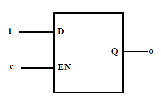

### 13.1.2 Edge-Triggered Registers, Flip-flops, Counters

A **register (flip-flop)** is inferred by using posedge or negedge clause for the clock in the event list of an always block.
To add an asynchronous reset, include a second posedge/negedge for the rest and use the if (reset) ... else statement.\
Note that when you use the negedge for the reset (active low reset), the if condition is (!reset).

***Syntax***

```verilog
always @(posedge clk or posedge reset_1 or negedge resert_2) begin
    if (reset_1) begin
        ...reset assignment...
    end
    else if (!reset_2) begin
        ...reset assignments...
    end
    else begin
        ...register assignments...
    end
endmodule
```

Example 13.1.2

```verilog
always @(posedge clk) begin
    a <= b & c;
end
```

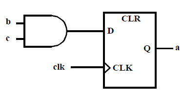

```verilog
always @(posedge clk or negedge rst) begin
    if (!rst) a <= 0;
    else a <= b;
end
```

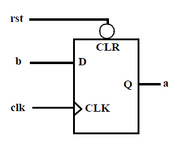

Example 13.2 (An Enabled Counter)

```verilog
reg [7:0] count;
wire enable;

always @(posedge clk or posedge rst) begin    // Do not include enable
    if (rst) count <= 0;
    else if (enable) count <= count + 1;
end                     // 8 filp-flops will be generated
```

### 13.2 Multiplexers

A **multiplexer** is inferred by assigning a variable to different variables/values in each branch of an if or case statement.
You can avoid specifying each and every possible branch by using the else and default branches.
Note that a latch will be inferred if a variable is **not** assigned to for all the possible branch conditions.\
To improve readability of your code, use the case statement to model large multiplexers.

***Syntax***

See Sections 8.9 and 8.10 for
**if** ... **else if** ... **else** and **case** statements

Example 13.2

```verilog
if (sel ==1)
    y = a;
else
    y = b;
```

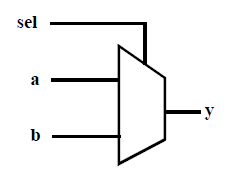

```verilog
case (sel)
    2'b00: y = a;
    2'b01: y = b;
    2'b10: y = c;
    default: y = d;
endcase
```

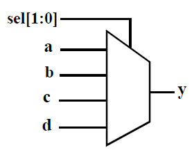

### 13.3  Adders/Subtracters

The +/- operators infer an adder/subtracter whose width depend on the width of the larger operand.

***Syntax***

See Section 7 for operators

Example 13.3

```verilog
if (sel == 1)
    y = a + b;
else
    y = c + d;
```

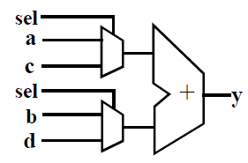

### Tri-State Buffers

A **tristate buffer** is inferred if a variable is conditionally assigned a value of z using an if, case, or conditional operator.

***Syntax***

See Sections 8.9 and 8.10 for
**if** ... **else if** ... **else** and **case** statements

Example 13.4

```verilog
if (en == 1)
    y = a;
else
    y = 1'bz;
```

### Other Component Inferences

Most logic gates are inferred by the use of their corresponding operators.
Alternatively, a gate or component may be explicitly instantiated by using the primitive gates (**and, or, nor, inv** ...) provided in the Verilog language.

## Section 14: Finitie State Machines (For Synthesis)

When modeling finite state machines, it is recommended to **separate** the sequential current-state logic from the combinational next-state and output logic.

***State Diagram***

For lack of space, the outputs are not shown on the state diagram, but are:

```verilog
in state0: Zot = 000,
in state1: Zot = 101,
in state2: Zot: 111,
in state3: Zot: 001.
```

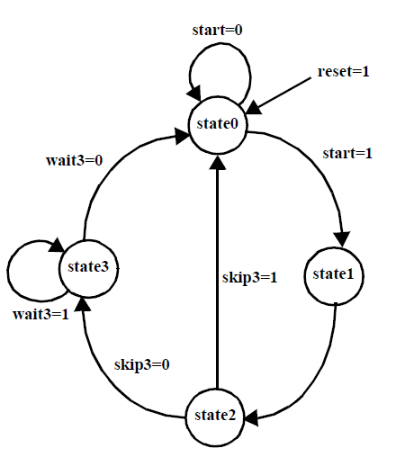

**Using Macros for state definition**\
As an alternative for

**parameter** state0 = 0, state1 = 1, state2 = 2, state3 = 3;

one can use macros.
For example after the definition below 2'd0 will be textually substituted whenever `start0 is used.

- `define state0 2'd0
- `define state0 2'd1
- `define state0 2'd2
- `define state0 2'd3

When using maxro definitions one must put a back quote in front.
For example:

```verilog
case (state)
    `state0: Zot = 3'b000;
    `state1: Zot = 3'b101;
    `state2: Zot = 3'b111;
    `state3: Zot = 3'b001;
```

Example 14.1

```verilog
module my_fsm (clk, rst, start, skip3, wait3, Zot);
    input clk, rst, start, skip3, wait3;
    output reg [2:0] Zot;   // Zot is declared reg so that it can be assigned in an always block

    parameter stat0 = 0, state1 = 1, state2 = 2, state3 = 3;
    reg [1:0] state, nxt_st;

    always @(state or start or skip3 or wait3)
        begin: next_state_logic     // name of always procedure
            case (state)
                state0: begin
                    if (start) nxt_st = state1;
                    else nxt_st = state0;
                end

                state1: begin
                    nxt_st = state2;
                end

                state2: begin
                    if (skip3) nxt_st = state0;
                    else nxt_st = state3;
                end

                state3: begin
                    if (wait3) nxt_st = state3;
                    else nxt_st = state0;
                end

                default: nxt_st = state0;
            endcase
        end

    alwasy @(posedge clk or posedge rst)
        begin: register_generation
            if (rst) state = state0;
            else state = nxt_st;
        end

    always @(state) begin: output_logic
        case (state)
            state0: Zot = 3'b000;
            state1: Zot = 3'b101;
            state2: Zot = 3'b111;
            state3: Zot = 3'b001;
            default: Zot = 3'b000;  // default avoids latches
        endcase
    end
endmodule
```

### 14.2 Counters

**Counters** are a simple type of finite-state machine where **separation** of the flip-flop generation code and the next-state generation code is not worth the effort.
In such code, use the non-blocking `<=` assignment operator.

***Binary Counter***

Using toggle flip-flops

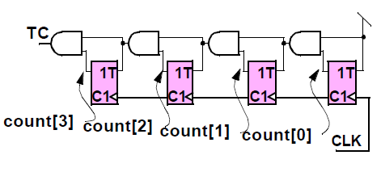

Example 14.2

```verilog
reg [3:0] count;
wire TC;    // terminal count (carry out)

always @(posedge clk or posedge rset) begin
    if (rset) count <= 0;
    else count <= count + 1;
end

assign TC = & count;    // See Section 5.5 on'Reduction Operators'
```

### 14.3 Shift Registers

**Shift registers** are also best done completely in the flip-flop generation code.
Use the non-blocking `<=` assignment operator so the operators `<<N` shifts left N bits.
The operator `>>N` shifts right N bits.
(See Example 8.3)

***Shift Register***

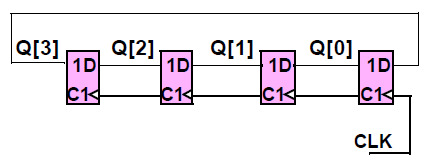

Example 14.3.1

```verilog
reg [3:0] Q;

always @(posedge clk or posedge rset) begin
    if (rset) Q <= 0;
    else begin
        Q <= Q<<1;      // left shift 1 position
        Q[0] <= Q[3];   // non-blocking means the old Q[3] is sent to Q[0]
                        // NOT the revised Q[3] from the previous line
    end
end
```

***Linear-Feedback Shift Register***

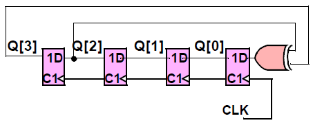

Example 14.3.2

```verilog
reg [3:0] Q;

always @(posedge clk or posedge rset) begin
    if (rset) Q <= 0;
    else Q <= {Q[2:1]: Q[3]^Q[2]};      // The concatenation operators '{}' form the new Q from elements of the old Q
end
```

### Section 15: Compiler Directives

Compiler directives are special commands, beginning with **`**, that affect the operation of the Verilog simulator.

### 15.1 Time Scale

**`timescale** specifies the time unit and time precision.
A time unit of 10 ns means a time expressed as say #2.3 will have a delay of 23.0ns.
Time precision specifies how delay values are to be rounde off during simulation.
Valid time units include s, ms, us, ns, ps, fs.\
Only 1, 10, or 100 are valid integers for specifying time units or precision.
It also determines the displayed time units in display commands like **$dispaly**.

***Syntax***

**`timescale** time_unit / time_precision;

Example 15.1

```verilog
`timescale 1ns / 1ps        // unit = 1ns, precision = 1/1000ns
`timescale 1ns / 100ps        // unit = 1ns, precision = 1/1ns
```

### 15.2 Macro Definitions

A macro is an identifier that represents a string of text.
Macros are defined with the directive **`define**, and are invoked with the quoted macro name as shown in the example below.

***Syntax***

```verilog
`define macro_nameText_string;
    ...`macro_name...
```

Example 15.2

```verilog
`define add_lsb a[7:0] + b[7:0]
assign o = `add_lsb;    // assign o = a[7:0] + b[7:0];
```

### 15.3 Include Directive

Include is used to include the contents of a text file at the point in the current file where the include directive is.
The include directive is similar to the C/C++ include directive.

***Syntax***

```verilog
`include file_name;
```

Example 15.3

```verilog
module xl;
    `include "dclr.v";  // contents of file "dclr.v" are put here
```

## Section 16: System Tasks and Functions

These are tasks and functions that are used to generate input and output during simulation.
Their names begin with a dollar sign (**$**).\
System tasks that extract data, like **$monitor** need to be in an **initial** or **always** block.

### 16.1 $display, $strobe, $monitor

These commands have the same syntax, and display their values as text on the screen during simulation.
They are much less convenient than waveform display tools like *cwaves* or *Signalscan*.
**$display** and **$strobe** display once every time they are executed, whereas **$monitor** displays every time one of its parameter chagnes.
The difference between **$display** and **$strobe** is that **$strobe** displays the parameters at the very end of the current simulation time unit.
The format string is like that in C/C++, and may contain format characters.
Format characters include **%d** (decimal), **%h** (hexadecimal), **%b** (binary), **%c** (character), **%s** (string) and **%t** (time).
Append b, h, o to the task name to change default format to binary, octal, or hexadecimal.

***Syntax***

```verilog
$display ("format_string", par_1, par_2);
```

Example 16.1

```verilog
initial begin
    $display (b, d);    // displayed in hexadecimal
    $monitor ("at time = %t, d = %h", $time, a);
end
```

### 16.2 $time, $stime, $realtime

These return the current simulation time as a 64-bit integer, a 32-bit integer, and a real number, respectively.
Their use is illustrated in Examples 4.6 and 13.1.

### 16.3 $reset, $stop. $finish

**$reset** resets the simulation back to time 0.
**$stop** halts the simulator and puts it in the interactive mode where the user can enter commands.
**$finish** exits the simulator back to the operating system.

### 16.4 $deposit

**$deposit** sets a net to a particular value.

***Synatx***

```verilog
$deposit (netname, value);
```

Example 16.2

```verilog
$deposit (b, 1'b0);
$deposit (outp, 4'b001x);   // outp is a 4-bit bus
```

### 16.5 $scope, $showscope

**$scope** (hierarchy_name) sets the current hierarchical scope to hierarchy_name.
**$showscopes(n)** lists all modules, tasks, and block names in (and below, if n is set to 1) the current scope.

### 16.6 $list

**$list** (hierarchy_name) lists line-numbered source code of the named module, task, function or named-block.

### 16.7 $random

**$random** generates a random integer every time it is called.
If the sequence is to be repeatable, the first time one invokes random give it a numerical argument (a seed).
Otherwise, the seed is derived from the computer disk.

***Syntax***

```verilog
xzz = $random[(integer)];
```

Example 16.3

```verilog
reg [3:0] xyz;

initial begin
    xyz = $random(7);   // seed the generator so number sequence will repeat if simulation is restarted

    forever xyz = #20 $random;  // The 4 lsb bits of the random integers will transfer into the xyz.
                                // Thus xyz will be a random integer 0 <= xyz <= 15
end
```

### 16.8 $dumpfile, $dumppvar, $dumpon, $dumpoff, $dumppall

These can dump variable changes to a simulation viewer like ***cwaves***.
The dump files are capable of dumping all the variables in a simulation.
This is convenient for debugging, but can be very slow.

***Syntax***

```verilog
$dumpfile("filename.dmp")

$dumpvar   // dumps all variables in the design
$dumpvar(1, top)    // dumps all the variables in module top and below, but not modules instantiated in top
$dumpvar(2, top)    // dumps all the variables in module top and 1 level below
$dumpvar(n, top)    // dumps all the variables in module top and n-1 level below
$dumpvar(0, top)    // dumps all the variables in module top and all level below

$dumpon initiates the dump
$dumpoff stop dumping
```

Example 16.4

```verilog
// Test Bench
module testbench
    reg a, b;
    wire c;

    initial begin
        $dumpfile("cwave_data.dmp");
        $dumpvar    // Dump all the variables
        // Alternately instead of $dumpvar, one could use
        $dimpvar(1, top)    // Dump variables in the top module
        // Ready to turn on the dump
        $dumpon
            a = 1;
            b = 0;
            topmodule top(a, b, c);
    end
endmodule
```

### $shm_probe, $shm_open

These are special commands for the *Simulation History Manager* for Cadence *cwaves* only.
They will save variable changes for later display.

***Syntax***

```verilog
$shm_open("cwave_dump.dm");
$shm_probe (var1, var2, var3);   // Dump all changes in the 3 variables
$shm_probe (a, b, inst1.var1, inst2.var2);  // Use the qualifier inst1. to look inside the hierarchy
                                            // Here inside module instance "inst1" the variables var1 and var2 will be dumped
```

Example 16.5

```verilog
// Test Bench
module testbench begin
    reg a, b;
    wire c;

    initial begin
        $shm_open("cwave_data.dmp");
        $shm_probe(a, b, c);
    end
end
```

## Section 17: Test Benches

A test bench supplis the signals and dumps the outputs to simulate a Verilog design (module(s)).
It invokes the design under test, generates the simulation input vectors, and implements the system tasks to view/format the results of the simulation.
It is **never synthesized** so it can use all Verilog commands.\
To view the waveforms when using Cadence Verilog XL simulator, use the Cadence-specific Simulation History Manager (SHM) tasks of **$shm_open** to open the file to store the waveforms, and **$shm_probe** to specify the variables to be included in the waveforms list.
You can then use the Cadence **cwaves** waveform viewer by typing **cwaves &** at the UNIX prompt.

***Syntax***

```verilog
$shm_open(filename);
$shm_probe(var1, var2, ...);

Note also
var = $random;
wait(condition) statement
```

Example 17.1

```verilog
'timescale 1 ns/ 100 ps     // time unit = 1ns; precision = 1/10 ns;
module my_fsm_tb;       // Test bench of FSM design of Example 14.1
    // ports of the design under test are variables in the test bench
    reg clk, rst, start, skip3, wait3;
    wire Button;

    // DESIGN TO SIMULATE (my_fsm) INSTANTIATION
    my_fsm dut1(clk, rst, start, skip3, wait3, Button)   // DUT: Device Under Test

    // SCTION TO DISPLAY VARIABLES
    initial begin
        $shm_open ("sim.db");   // open the SHM database file
        $shm_probe (clk, reset, start);
        // Use the qualifier dut1. to look at variables inside the instance dut1
        $shm_probe (skip3, wait3, Button, dut1.state, dut1.nxt_st);
    end

    // RESET AND CLOCK SECTION
    initial begin
        clk = 0;
        rst = 0;

        #1 rst = 1;     // the delay gives rst a posedge for sure

        #200 rst = 0;   // deactivate reset after two clock cycles + 1 ns
    end

    always #50 clk = ~clk;  // 10 MHz clock (50*1 ns*2) with 50% duty-cycle

    initial begin
        skipe3 = 0;     // at t=0, wait3=0 and skip3=0
        wait3 = 0;

        #1;     // Delay to keep inputs from changing on clock edge

        #600 skip3 = 1;     // at t=601, wait3=0 and skip3=1
        #400 wait3 = 1;     // at t=1001, wait3=1 and skip3 = 0
        skip3 = 0;

        #400 skip3 = 1;     // at t=1401, wait3=1 and skip3=1

        wait(Button) skip3 = 0;     // wait until Button=1, then make skip3 zero
        wait3 = $random;    // generate a random number, trasnfer lsb into wait3

        $finish;        // stop simulation. Without this it will not stop
    end
endmodule
```

### 17.1 Synchronous Test Bench

In synchronous designs, one changes the data during certain clock cycles.
In the previous test bench one had to keep counting delays to be sure the daya came in the right cycle.
With a synchronous test bench the input data iss stored in a vector or array and one part injected in each clock cycle.
The Verilog array is not defined in these notes.\
Synchronous test benches are essential for cycle based simulators which do not use any delays smaller than a clock cycle

***Things to ntoe:***

data[8:1] = 8'b1010_1101;\
The underscore visually separates the bits.
It acts like a comment.

**if** (I == 9) **$finish;
When the data is used up, finish**

x <= data[I]; I <= I+1;\
When synthesizing to flip-flops as in an\
In an @(posedge... procedure, always use non-blocking.\
Without that you will be racing with the flip-flops in the other modules.

Example 17.2

```verilog
// Synchronous test bench
module SynchTstBch
    reg [8:1] data;
    reg x, clk;
    integer I;

    initial begin
        data [8:1] = 8'b1010_1191;  // Underscore spaces bits
        I = 1;
        X = 10;
        clk = 0;
        forever #5 clk = ~clk;
    end

    // Send in a new value of x every clock cycle
    always @(posedge clk)
        begin
            if (I == 9) $finish;
            #1      // keeps data from changing on clock edge
            x <= data[I];
            I = I+1;
        end

    topmod top1(clk, x);
endmodule
```
